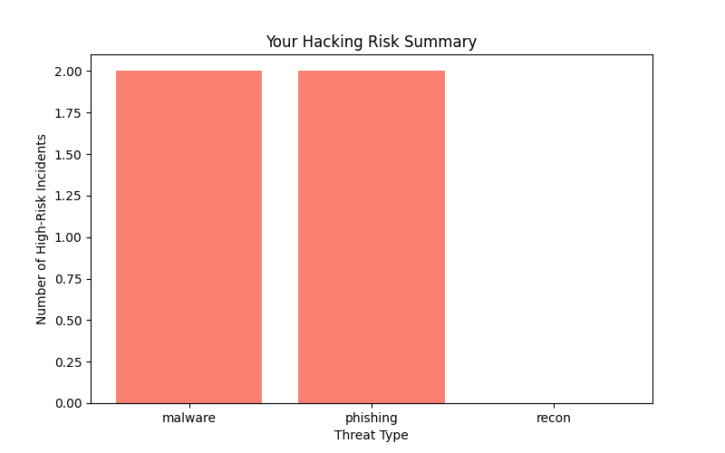

# CTI Risk Analyzer



**A Python-based tool leveraging Cyber Threat Intelligence (CTI) and AI to assess and visualize hacking risks for customers.**

## Overview

The CTI Risk Analyzer processes commercial CTI feeds to identify cybersecurity threats (e.g., phishing, malware) and generates customer-friendly reports. By combining real-time threat intelligence with machine learning, it empowers users to understand their hacking risks and take proactive measures.

This project serves as a proof-of-concept for bridging CTI expertise with AI-driven insights, leveraging unique commercial feeds to deliver actionable value.

## Features

- **CTI Parsing**: Extracts key indicators like threat type and severity from structured data (e.g., JSON feeds).
- **AI Analysis**: Uses a Random Forest Classifier to predict high-risk threats based on patterns.
- **Customer Reports**: Produces concise text summaries and visualizations of hacking risks.
- **Extensible**: Designed to integrate with live feeds and scale with advanced AI techniques.

## Installation

### Prerequisites
- Python 3.8+
- Git installed
- A GitHub account (for contributing or forking)

### Setup
1. **Clone the Repository**:
```bash
git clone https://github.com/yourusername/cti-risk-analyzer.git
cd cti-risk-analyzer